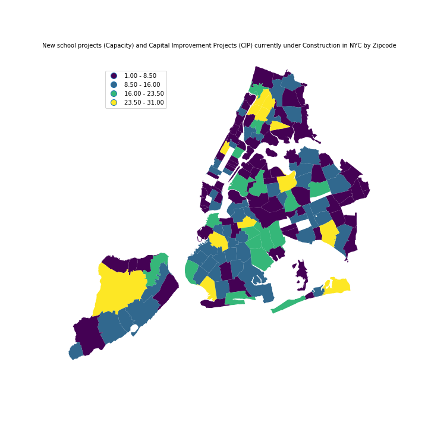

Note: data updated as of Nov 2, 2018 
Source: https://data.cityofnewyork.us/Housing-Development/Projects-in-Construction-Map/dzgh-ja44

### Figure 1: New school projects (Capacity) and Capital Improvement Projects (CIP) currently under Construction. ### 
#### Using data from the School Construction Athority (SCA), I attempted to visually analyze where new school projects are being constructed in New York City. By using a choropleth map, you can see the spatial variability of projects. The legend displays the amount or count of projects within the zip code. From the analysis, you can see that each borough has at least one zip code with greater than or equal to 23 projects. Additionally, you can see that the zip codes in Brooklyn probably have the highest total amount of construction projects compared to the other four boroughs. This makes sense with our knowledge of the amount of schools located in Brooklyn. 

**Note**: the zip codes illustrated with the color "white" signify no projects. After further analysis and ground-truthing, this makes sense that these areas wouldn't have any school construction projects.  