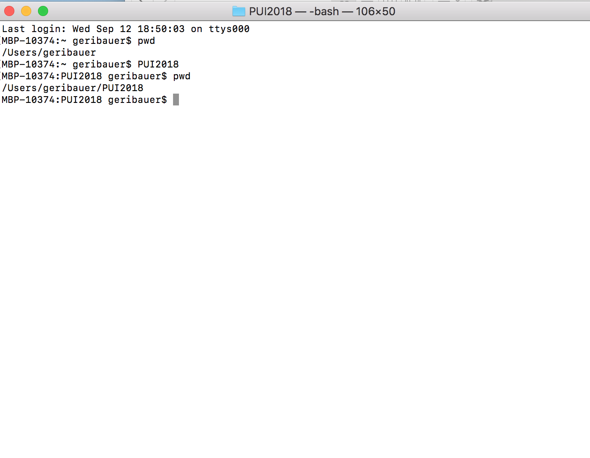
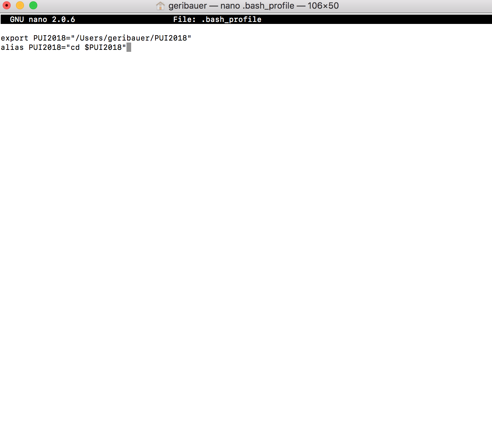

# Creating environmental variables and aliases for our PUI2018 directory.

### We created an environment variable called PUI2018 that pointed to our directory called PUI2018.

### To save our environmental variable permanently, we saved the code in .bashrc. This way, our $PUI2018 environmental variable is set to our PUI2018 directory. 

### We then created an alias as a shortcut command that changed directory into the PUI2018 directory.

### And finally, we took screenshots of our .bashrc file where we can see the alias and environmental variable we created.

