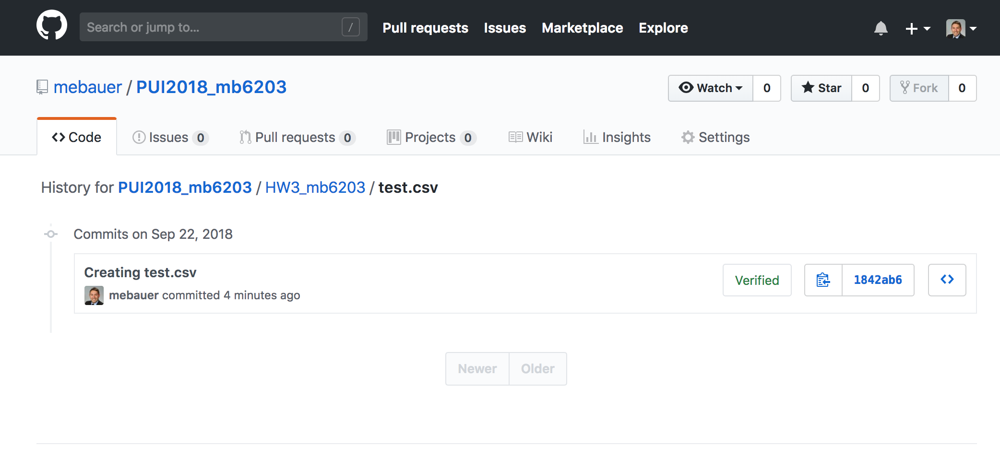
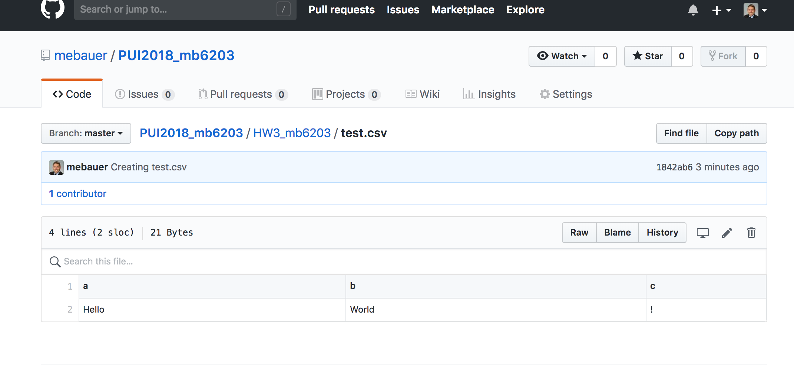
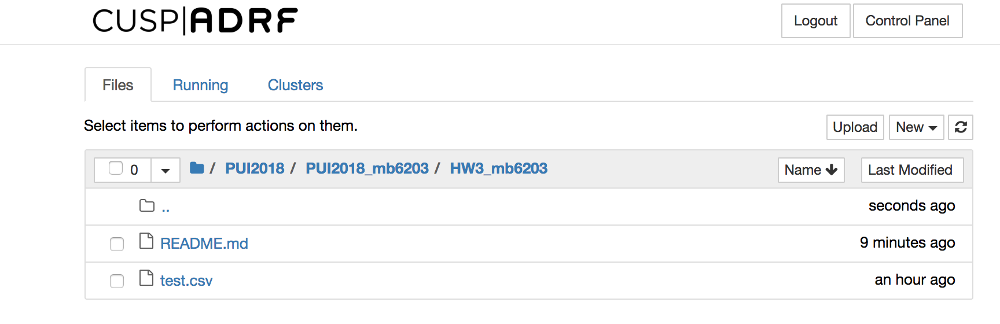
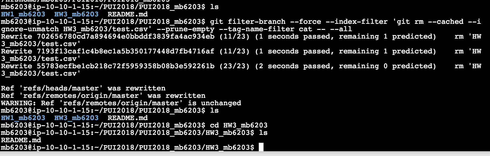
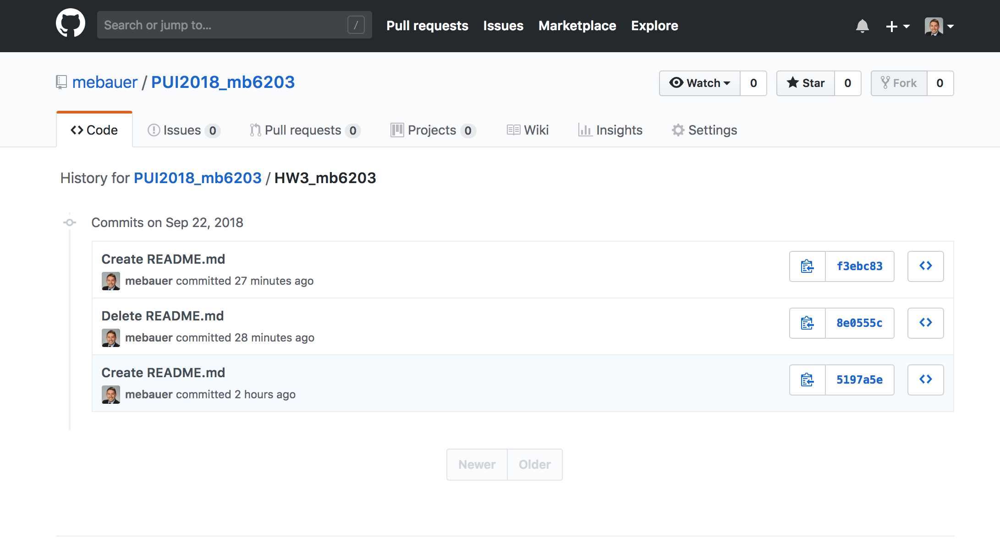

# PUI2018 HW 3 # 

# Part 1: perform the instruction in deleteData.md: delete data and its history from a GitHub repo # 

## Assignment 1: Delete data and its history from a GitHub repo##

Create File and Commit to Repo

Pull changes to PUI2018 Repo

Remove File and History from Repo

Screenshot of deleted history

# Part 2: Choose a file in CSV format from NYC Open Data and use pandas to read the file and mangle the data within it. # 

## Assignment 2: Read CSV files with pandas and use NYC open data portal ##

### PLEASE READ: Collaborated with: ###

I worked extensively with Yushi Chen, a student at NYU CUSP. 

## Assignment 2: Extra Credit Assignment : work with and APIs and dates in Pandas ##

### PLEASE READ: Collaborated with: ###

I worked extensively with Yushi Chen, a student at NYU CUSP. Additionally, I received assistance formatting the chart from Qinyu Goh, a student at NYU CUSP.

# Part 3: Write scripts to stream real-time bus data from MTA through the MTA Bus Time interface. In order to access this data, you must first request an API key from MTA. # 

## Assignment 3: Tracking each vehicle for a line ##

## Assignment 4: Next stop information ##

### PLEASE READ: Collaborated with: ###

These last two assignments were particularly challenging for me. Thus, I had extensive help getting started through the code, creating the python script, and also received assistance debugging at the end. I received the most assistance creating the python script, forming arguments, and the correct syntax of the code.

Students involved in assisting me:
- Yushi Chen
- Tanya Nabila
- Marvin Mananghaya
- Urwa Muaz
- Manrique Vargas

I can't stress this enough that these last two assignments were particulularly challenging for me. All of the student guidance/feedback was in-person at CUSP's building, and extensive explanation was provided to me by all of these students while working through code.