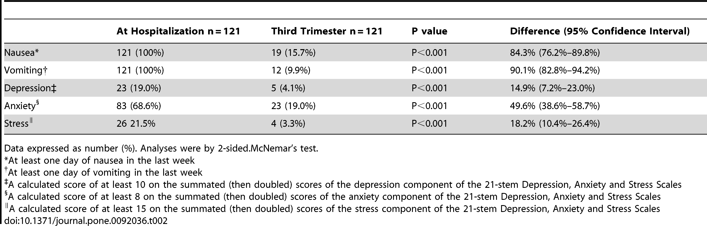
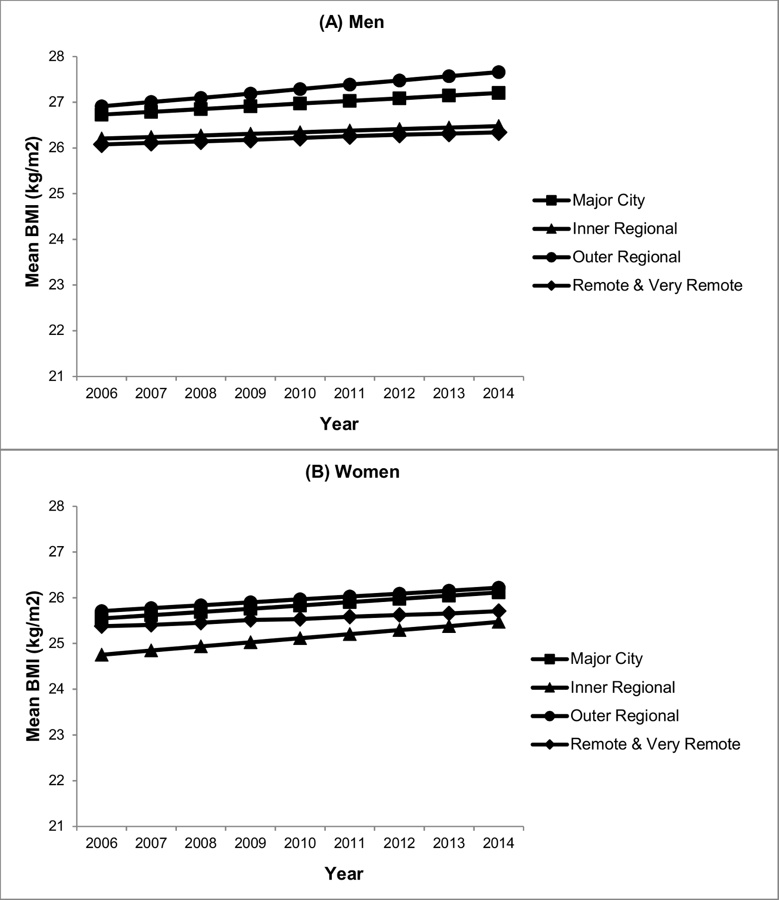
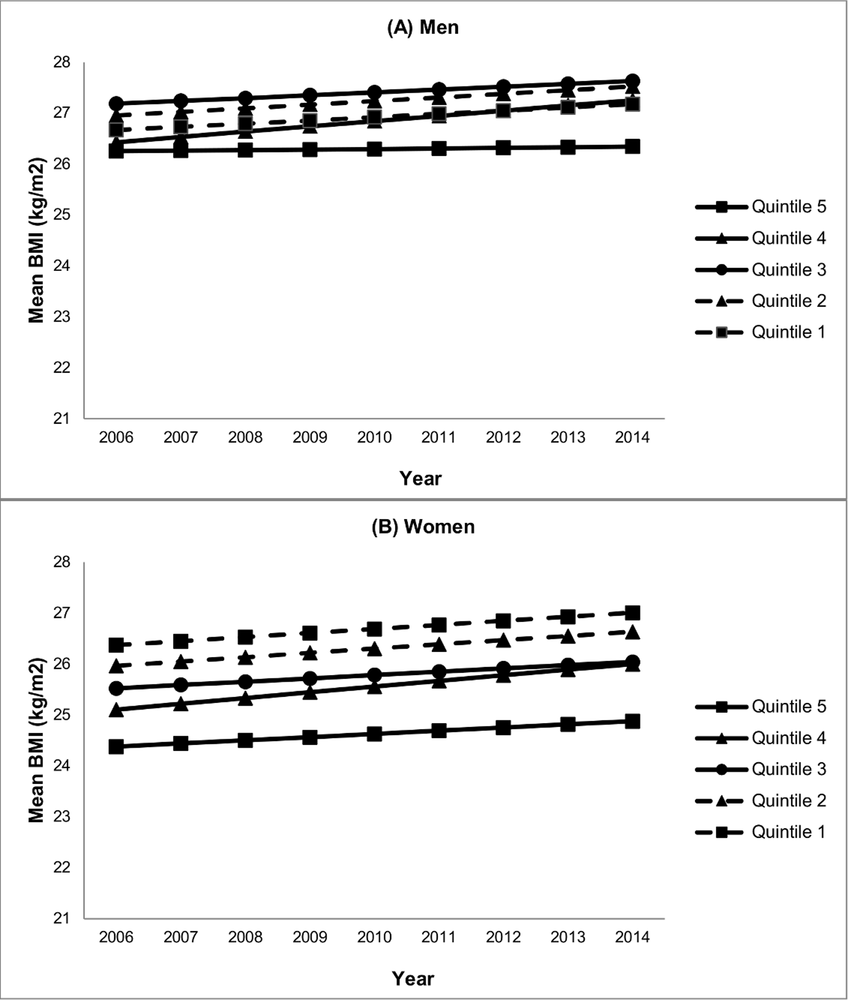

# This is my README file for HW6

## Assignment 1: Review your classmate's Citibike project proposal
You will recieve an email tonight with the name, nyuID, and GitHub username of a classmate.

check that at least one of these class-mates is not already in your group for HW4 and contact me promptly if they both are! By lunch time tomorrow I want to do the necessary reassignments so that each of you is paired with a classmate so I need to know ASAP.

look in the classmate HW4_<netid> repo ASAP and identify their submission for the citibike project. If you cannot find it contact them immediately!

Fork their repository and clone it (you did this in HW1, look at the instructions in the HW1 README if you need to refresh your memory) - only read up to the experimantal setup and verify the data to answer the question is available. Do not consider the way they answer the question if they already did!

Read it carefully (but do not modify the notebook)! You have to:

a. verify that their Null and alternative hypotheses are formulated correctly

b. verify that the data supports the project: i.e. if the a data has the appropriate features (variables) to answer the question, and if the data was properly pre-processed to extract the needed values (there is some flexibility here since the test was not chosen yet)

c. chose an appropriate test to test H0 given the type of data, and the question asked. You can refer to the flowchart of statistical tests for this in the slides, or here, or Statistics in a Nutshell.

Write your comments, suggestions, and suggested an appropriate statistical test, motivating your test choice, in a markdown named CitibikeReview_<netID>.md. Suggest variations on the question, if you think it may be made more interesting.

Do not perform the test yet.

Submit a pull request to the original repository to share your markdown.

## Assignment 2: Literature choices of statistical tests
Work with one, or maximum two people.

Choose three tests from the table in the slides

stats test

one in the top potrion of the chart (chi-sq, t-test, and the ANOVA family of tests) where you are looking for differences between groups, and one in the bottom portion where you are looking for relationships bewteen the dependent and independent variables (correlation, regression, path analysis), and a logistic regression.

Go to the main web page of the journal PLOS ONE and search for articles that use that test (DO NOT USE THE ARTICLE I USED FOR THE CLASS EXAMPLE: http://journals.plos.org/plosone/article?id=10.1371/journal.pone.0062593).

Put the name of your tests (one by one) in the search (you can also use the advanced search) and choose a paper that uses the test you selected. Read the relevant portions of the paper (the abstract, and then a search for occurrences of the test name may be sufficient!) and identify what are the Dependent Variables (DV), Independent Variables (IV), and, if applicable, control variables (remember class 2 slides if you forgot), how many they are, and what type they are (categorical, continuous...).

Write out the number of DV, type of DV, number of IV, type of IV, number of control variables, kind of questions as a table in your README.md file, filling in the same fields as in the first table in the literature about "When to use what test?".

This is a template for the table. To see how it is written clock on the Raw link to see this README.md in its raw unrendered format.

| **Statistical Analyses**	|  **IV(s)**  |  **IV type(s)** |  **DV(s)**  |  **DV type(s)**  |  **Control Var** | **Control Var type**  | **Question to be answered** | **_H0_** | **alpha** | **link to paper**| 
|:----------:|:----------|:------------|:-------------|:-------------|:------------|:------------- |:------------------|:----:|:-------:|:-------|
| ANOVA	| stable isotopes values and fatty acid signatures  | nominal | feeding ecology | continuous | bat species | nominal | 	The aim was to assess whether stable isotope and fatty acid signatures of faeces can be used to determine feeding preferences. | faeces stable isotope and fatty acid signatures won't affect the terrestrial, aquatic and mixed feeding niches of Myotis myotis, M. daubentonii, and M. mystacinus, respectively. | p < 0.001 | https://journals.plos.org/plosone/article?id=10.1371/journal.pone.0083452
Correlation	| 3, trimester of pregnancy | Ordinal | 1+, symptom of pregnancy (nausea, vomiting, depression, anxiety and stress)| Categorical | N/A | Pregnant women with Hyperemesis |Are pregnant women with HG more likely to experience symptoms of depression earlier in pregnancy, vs. pregnant women without HG| Symptoms of stress, anxiety, and depression in women with HG >= Symptoms for non-HG pregnant women | <0.05 | [Depression, Anxiety, Stress and Hyperemesis Gravidarum: Temporal and Case Controlled Correlates](https://journals.plos.org/plosone/article?id=10.1371/journal.pone.0092036) |
Logical Regression	| 1+, Neighborhood Disadvantange, and geographic remoteness | Ordinal | 1, Body-mass Index| Continous | 1+, age (15-24),and gender | categorical and nominal |Are immigrants living in disadvantaged,remote neighborhoods more likely to have a higher BMI?| BMI of Immigrants in remote disdvataged neighborhoods =< BMI of immigrants in accessible,good neighborhoods | 0.05 | [Neighbourhood disadvantage, geographic remoteness and body mass index among immigrants to Australia](https://journals.plos.org/plosone/article?id=10.1371/journal.pone.0191729#sec002) |

Include the main plot of the paper (the plot that summarized the result)

Test1: Plot of stable isotope values A. δ15N versus δ13C and B. δ34S versus δ13C for Myotis myotis, M. mystacinus and M. daubentonii. Values indicate that each species occupied a different isotopic niche. The population of M. myotis (Ermatingen) (open circles), which roosted closer to water, occupied the same niche as the population farther away (full circles).

Test 2: Comparison of Nausea, Vomiting, Depression, Anxiety and Stress at Hospitalization for Hyperemesis Gravidarum and at the Third Trimester

Test 3: 
Immigrant BMI trends over time by geographic remoteness (2006–2014)

## Assignment 3: Reproduce the analysis of the Hard to Employ program in NY:
Reproduce the analysis of the Hard to Employ programs for NY. You may want to read the relevant portion of the study to make sure you are not just workign mechanically (Chapter 2 of the original document).

Reproduce the results in cell 2 of Table 2.1 (Ever employed in a CEO transitional job), and cell 10 (Convicted of a felony). Fill in the cells of the scheleton notebook as you are asked to.

Turn in your version of the python notebook in the HW6_<netID> directory

## Assignment 4: Tests of correlation using the scipy package with citibike data.
Use the following are 3 tests to assess correlation between 2 samples of citibike data:

Pearson’s test
Spearman’s test
K-S test
There is a skeleton notebook that works on a similar question, age of male vs female riders. Follow it to see how to set up the assignment notebook citibikes_compare_distributions.ipynb.

Use: trip duration of bikers that ride during the day vs night. State your result in words in terms of the Null Hypothesis

Use: age of bikers for trips originating in Manhattan and in Brooklyn. Use at least 2 months of citibike data. Extra Credit

