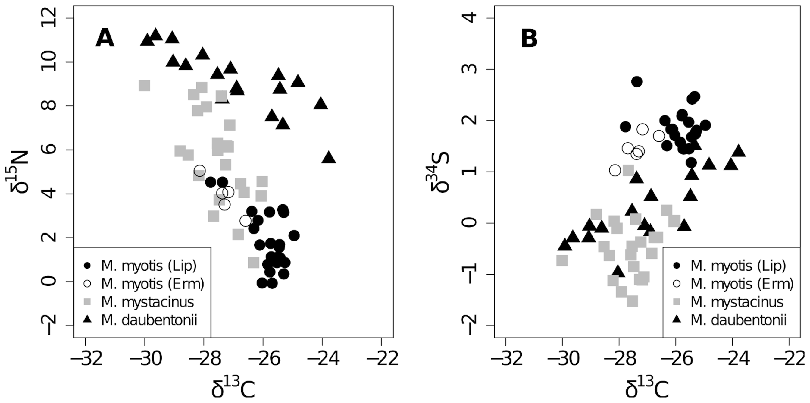

# This is my README file for HW6

## For Professor Bianco

Dear Professor Bianco,

I am utilizing my 72-hour extension for homework 6. I work full-time, and I had two exams for another graduate program I am pursuing in Coastal Sciences and Hydrodynamics.

Also, pleased be advised that I did not recieve any pull request for assignment 1. Maybe I wasn't assigned a reviewer? 

**Technical Details about HW6:**

Homework 3 and 4 I utilized your *solutions* notebooks. Although the output looks fairly similar, I attempted to change items where I could (i.e. assigning variables new names, new comments in my own words, etc.). 

## Assignment 1: Review your classmate's Citibike project proposal

Assignment 1 is titled CitibikeReview_mb6203.md

Submit a pull request to the original repository to share your markdown.

## Assignment 2: Literature choices of statistical tests
The last two tests were performed with assistance from **Alia Kasem**

Work with one, or maximum two people (**I worked with Alia**).

Choose three tests from the table in the slides

stats test

one in the top potrion of the chart (chi-sq, t-test, and the ANOVA family of tests) where you are looking for differences between groups, and one in the bottom portion where you are looking for relationships bewteen the dependent and independent variables (correlation, regression, path analysis), and a logistic regression.

| **Statistical Analyses**	|  **IV(s)**  |  **IV type(s)** |  **DV(s)**  |  **DV type(s)**  |  **Control Var** | **Control Var type**  | **Question to be answered** | **_H0_** | **alpha** | **link to paper**| 
|:----------:|:----------|:------------|:-------------|:-------------|:------------|:------------- |:------------------|:----:|:-------:|:-------|
| ANOVA	| stable isotopes values and fatty acid signatures  | nominal | feeding ecology | continuous | bat species | nominal | 	The aim was to assess whether stable isotope and fatty acid signatures of faeces can be used to determine feeding preferences. | faeces stable isotope and fatty acid signatures won't affect the terrestrial, aquatic and mixed feeding niches of Myotis myotis, M. daubentonii, and M. mystacinus, respectively. | p < 0.001 | https://journals.plos.org/plosone/article?id=10.1371/journal.pone.0083452
Correlation	| 3, trimester of pregnancy | Ordinal | 1+, symptom of pregnancy (nausea, vomiting, depression, anxiety and stress)| Categorical | N/A | Pregnant women with Hyperemesis |Are pregnant women with HG more likely to experience symptoms of depression earlier in pregnancy, vs. pregnant women without HG| Symptoms of stress, anxiety, and depression in women with HG >= Symptoms for non-HG pregnant women | <0.05 | [Depression, Anxiety, Stress and Hyperemesis Gravidarum: Temporal and Case Controlled Correlates](https://journals.plos.org/plosone/article?id=10.1371/journal.pone.0092036) |
Logical Regression	| 1+, Neighborhood Disadvantange, and geographic remoteness | Ordinal | 1, Body-mass Index| Continous | 1+, age (15-24),and gender | categorical and nominal |Are immigrants living in disadvantaged,remote neighborhoods more likely to have a higher BMI?| BMI of Immigrants in remote disdvataged neighborhoods =< BMI of immigrants in accessible,good neighborhoods | 0.05 | [Neighbourhood disadvantage, geographic remoteness and body mass index among immigrants to Australia](https://journals.plos.org/plosone/article?id=10.1371/journal.pone.0191729#sec002) |

Test 1: Plot of stable isotope values A. δ15N versus δ13C and B. δ34S versus δ13C for Myotis myotis, M. mystacinus and M. daubentonii. Values indicate that each species occupied a different isotopic niche. The population of M. myotis (Ermatingen) (open circles), which roosted closer to water, occupied the same niche as the population farther away (full circles).

Test 2: Comparison of Nausea, Vomiting, Depression, Anxiety and Stress at Hospitalization for Hyperemesis Gravidarum and at the Third Trimester

Test 3: 
Immigrant BMI trends over time by geographic remoteness (2006–2014)

## Assignment 3: Reproduce the analysis of the Hard to Employ program in NY:

My python notebook is titled HW6_assignment3.ipynb 

## Assignment 4: Tests of correlation using the scipy package with citibike data.

My python notebook is titled HW6_assignment4.ipynb 

