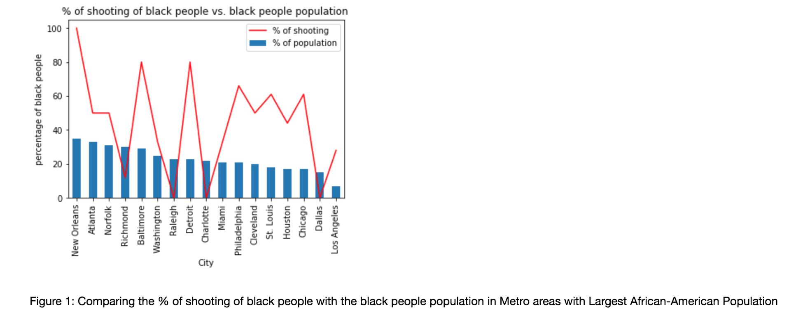

# PUI2018 HW9: Plot review assignment #

Also upload the review to their HW8_<netID> repository via Fork/Pull request. That means: you must make a fork of the classmate PUI2018_<netID> (their netID) repository (see instruction in the previous peer assignment homework), *git add* the review markdown to **your** fork of **their** PUI2018 repository, in HW8_<netID> (their netID), and *git commit* the review markdown. Then submit a pull request. 

**Content**

Please be polite and constructive in your critique. You are trying to improve your classmate's work, and hopefully this will be an instructive experience for both you and your classmate. IMPORTANT: your grade for the plot peer review assignment will be based on the review, not on the plot you made. So be thoughtful and insightful!

Think about it as a peer review, which is something that is normally done on scientific papers in order to accept them or reject them for publication.  
Here are a few basic evaluation criteria; comment and make suggestions on each:

CLARITY: is the plot easy to read? is it clear or confusing, are the quantities being visualized ambiguous? 

ESTHETIC: beautiful is a subjective judgment: you should not judge the plot on the basis of whether you think it is "beautiful", but you should judge whether its esthetic is functional to what it is meant to communicate. Are the colors chosen appropriately? Are the graphical elements used appropriate to represent the quantities being visualized? Are the graphical choices allowing you to focus on the right elements or are they distracting you?

HONESTY: is the plot honestly reproducing the data or is it deforming it, perhaps to emphasize a point?

Important YOU MUST SUGGEST IMPROVEMENTS TO EACH PLOT!

